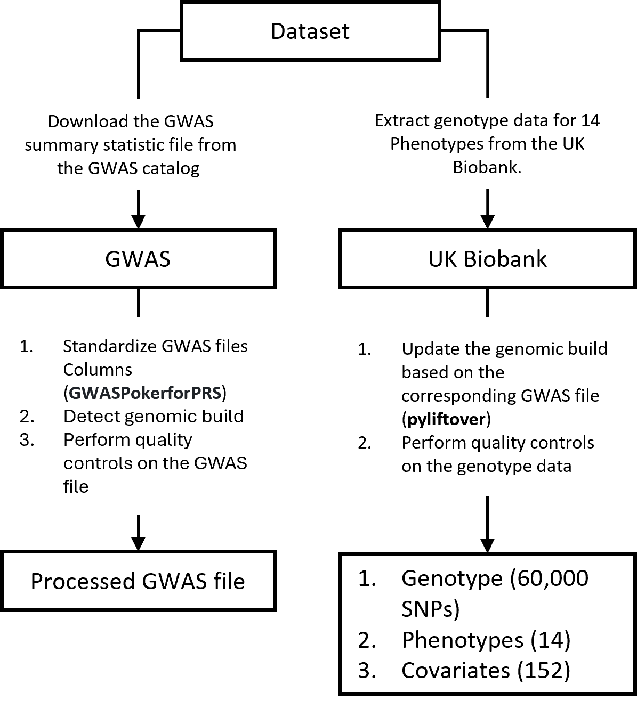

## Heritability tools

Multiple tools calculate heritability, as shown in the table below. Each tool uses different statistical methods to estimate heritability, and the datasets they use also vary. Some tools use the GWAS summary statistic file, some use genotype data, covariates, and PCA, and some use reference panels and SNP tagging.

| Tool        | URL                                                        |
|-------------|------------------------------------------------------------|
| GEMMA       | [https://github.com/genetics-statistics/GEMMA](https://github.com/genetics-statistics/GEMMA) |
| GCTA  | [http://cnsgenomics.com/software/gcta/#Overview](http://cnsgenomics.com/software/gcta/#Overview) |
| LDAK        | [http://dougspeed.com/ldak/](http://dougspeed.com/ldak/)   |
| DPR         | [https://github.com/biostatpzeng/DPR](https://github.com/biostatpzeng/DPR) |
| LDSC        | [https://github.com/bulik/ldsc](https://github.com/bulik/ldsc) |
| SumHer      | [http://dougspeed.com/sumher/](http://dougspeed.com/sumher/) |


## Purpose of this documentation

In this research, we used various heritability tools and created multiple variants of each method to calculate heritability for 11 phenotypes. Two polygenic risk scores (PRS) tools, LDpred-2 and GCTA, rely on heritability estimates for PRS calculation. We investigated whether the method used to calculate heritability impacts the performance of the PRS tools. Benchmarking all these tools is essential to identify the best method for heritability calculation that optimizes PRS calculation.


## Helper tools
 

| Tool | Description | Link |
|------|-------------|------|
| GWASPokerforPRS | A tool for downloading GWAS data from GWAS Catalog| [https://github.com/MuhammadMuneeb007/GWASPokerforPRS](https://github.com/MuhammadMuneeb007/GWASPokerforPRS) |
| Detect genomic build | Detect the genomic build of a dataset | [https://www.biostars.org/p/9495682/#9595219](https://www.biostars.org/p/9495682/#9595219) |
| pyliftover | A Python package for genomic coordinate conversion | [https://pypi.org/project/pyliftover/](https://pypi.org/project/pyliftover/) |

## Dataset

We analyzed 14 phenotypes from the UK Biobank and downloaded the corresponding GWAS files from the GWAS catalog (https://www.ebi.ac.uk/gwas/). After converting the genotype data to match the GWAS file's genotype build, we calculated the number of common variants between the GWAS files and the genotype data. Three phenotypes were removed from further analysis due to a limited number of variants.

## GWAS Data Processing

### Steps for Processing GWAS Data

1. **Download the GWAS file for a specific phenotype.**

2. **Transform the GWAS file to a specific format accepted by most PRS tools.** 
   - The sample transformation code for one phenotype (asthma) is shown below.

### Original GWAS file for asthma:
| chromosome | base_pair_location | effect_allele | other_allele | effect_allele_frequency | beta   | standard_error | p_value | variant_id |
|------------|--------------------|---------------|--------------|-------------------------|--------|----------------|---------|------------|
| 1          | 100000012          | T             | G            | 0.28029314035229        | 0.0055 | 0.0077         | 0.4756  | NA         |
| 1          | 10000006           | A             | G            | 0.00547967251882486     | -0.1081| 0.0560         | 0.05366 | NA         |
| 1          | 100000135          | T             | A            | 0.00172932855852879     | 0.0255 | 0.1026         | 0.8037  | NA         |
| 1          | 100000374          | C             | G            | 0.000580831145737331    | 0.0204 | 0.2956         | 0.9451  | NA         |
| 1          | 100000827          | T             | C            | 0.329735132840309       | 0.0016 | 0.0074         | 0.8236  | NA         |

### Transformation Code:
```python
import pandas as pd

df = pd.read_csv('gwas.csv.modified')
print(df.head())
print(df.columns)

column_map = {
    'chromosome': 'CHR', 
    'variant_id': 'SNP', 
    'base_pair_location': 'BP',
    'effect_allele': 'A1', 
    'other_allele': 'A2', 
    'p_value': 'P',
    'effect_allele_frequency': 'MAF', 
    'beta': 'BETA', 
    'standard_error': 'SE'
}

df = df.rename(columns=column_map)

df["SNP"] = "X"
df["INFO"] = 1
df["N"] = 449500

df = df[['CHR', 'BP', 'SNP', 'A1', 'A2', 'N', 'SE', 'P', 'BETA', 'INFO', 'MAF']]

df.to_csv('asthma.gz', compression='gzip', index=False, sep="\t")
```
| CHR | BP         | SNP | A1 | A2 | N     | SE    | P      | BETA   | INFO | MAF               |
|-----|------------|-----|----|----|-------|-------|--------|--------|------|-------------------|
| 1   | 100000012  | X   | T  | G  | 449500| 0.0077| 0.4756 | 0.0055 | 1    | 0.28029314035229  |
| 1   | 10000006   | X   | A  | G  | 449500| 0.056 | 0.05366| -0.1081| 1    | 0.0054796725188248|
| 1   | 100000135  | X   | T  | A  | 449500| 0.1026| 0.8037 | 0.0255 | 1    | 0.0017293285585287|

3.  Detect the genomic build of the GWAS.

4.  Handle missing RSID or SNP information:

- Generate two copies of the genotype data based on the GWAS build (hg19 or hg38).
- Find the common predictors and use the SNPs in the genotype .bim file to fill the SNP column in the GWAS.

| CHR | BP        | SNP         | A1 | A2 | N     | SE     | P      | BETA   | INFO | MAF               |
|-----|-----------|-------------|----|----|-------|--------|--------|--------|------|-------------------|
| 1   | 100008709 | rs55727773  | T  | G  | 449500| 0.0148 | 0.4387 | -0.0115| 1    | 0.881099991887257 |
| 1   | 100011667 | rs113462541 | C  | T  | 449500| 0.0096 | 0.4591 | 0.0071 | 1    | 0.835926208119123 |
| 1   | 100015703 | rs12028261  | T  | C  | 449500| 0.0071 | 0.6983 | 0.0027 | 1    | 0.505985657483862 |


5. Save the final file based on the following format:

```bash
# Define file paths for different data files
BED = asthma/asthma.bed
BIM = asthma/asthma.bim
FAM = asthma/asthma.fam
COV = asthma/asthma.COV
Height = asthma/asthma.PHENO
GWAS = asthma/asthma.gz
```


Below is the diagram showcasing data processing:




## Processed Data

| Phenotype                                | PMID     | File Name                           | SNPs in GWAS (G) | SNPs in Genotype data (GE) | Common in G and GE | DOI                              | Cite            |
|------------------------------------------|----------|-------------------------------------|------------------|----------------------------|--------------------|----------------------------------|-----------------|
| asthma                                   | 34594039 | GCST90018795_buildGRCh37.tsv.gz     | 25837674         | 619653                     | 2867               | 10.1038/s41588-021-00931-x       | Sakaue2021      |
| blood_pressure_medication                | 34662886 | GCST90081464_buildGRCh38.tsv.gz     | 447993           | 619653                     | 56                 | 10.1038/s41586-021-04103-z       | Backman2021     |
| body_mass_index_bmi                      | 34594039 | GCST90018947_buildGRCh37.tsv.gz     | 20538803         | 619653                     | 2866               | 10.1038/s41588-021-00931-x       | Sakaue2021      |
| cholesterol_lowering_medication          | 34662886 | GCST90079486_buildGRCh38.tsv.gz     | 133986           | 619653                     | 56                 | 10.1038/s41586-021-04103-z       | Backman2021     |
| depression                               | 29662059 | UKBiobank_broad_12Jan18.txt         | 7641987          | 619653                     | 545218             | 10.1038/s41467-018-03819-3       | Howard2018      |
| gastro_oesophageal_reflux_gord_gastric_reflux | 34594039 | GCST90018848_buildGRCh37.tsv.gz     | 25843128         | 619653                     | 2906               | 10.1038/s41588-021-00931-x       | Sakaue2021      |
| hayfever_allergic_rhinitis               | 34662886 | GCST90077815_buildGRCh38.tsv.gz     | 458874           | 619653                     | 56                 | 10.1038/s41586-021-04103-z       | Backman2021     |
| high_cholesterol                         | 29892013 | GCST90029021_buildGRCh37.tsv        | 12007882         | 619653                     | 562302             | 10.1038/s41588-018-0144-6        | Loh2018         |
| hypertension                             | 33893285 | GCST90086092_buildGRCh37.tsv        | 15650645         | 619653                     | 619653             | 10.1038/s41467-021-21952-4       | GuindoMartinez2021 |
| hypothyroidism_myxoedema                 | 34594039 | GCST90018862_buildGRCh37.tsv.gz     | 25801084         | 619653                     | 2908               | 10.1038/s41588-021-00931-x       | Sakaue2021      |
| irritable_bowel_syndrome                 | 34741163 | GCST90016564_buildGRCh37.tsv        | 9885499          | 619653                     | 568535             | 10.1038/s41588-021-00950-8       | Eijsbouts2021   |
| migraine                                 | 34737426 | GCST90043745_buildGRCh37.tsv.gz     | 11831933         | 619653                     | 548955             | 10.1038/s41588-021-00954-4       | Jiang2021       |
| osteoarthritis                           | 36411363 | GCST90134279_buildGRCh37.csv        | 24880768         | 619653                     | 619653             | 10.1038/s41588-022-01221-w       | McDonald2022    |


## Perform Quality Controls on the Data

The initial quality controls vary from dataset to dataset and depend on how the dataset is being stored, processed, and handled.  

### Initial Directory Structure

Before executing `Step1-MakeDirectories.py`, you should have the following directory structure:

```
.
├── body_mass_index_bmi
│   ├── GCST90018947_buildGRCh37.tsv.gz
│   ├── gwas.csv.modified
│   └── Output.py
├── genotypes.bed
├── genotypes.bim19
├── genotypes.bim38
├── genotypes.fam
├── phenotype_file.txt
└── Step1-MakeDirectories.py
```
 

Execute the command below. It will check build, and generate the files for a specific phenotype that includes covariate and bed bim and fam file. The code works for binary phenotype as well.

```
python Step1-MakeDirectories.py body_mass_index_bmi
```

Files after executing the above command.

```
.
├── body_mass_index_bmi
│   ├── body_mass_index_bmi.bed
│   ├── body_mass_index_bmi.bim
│   ├── body_mass_index_bmi.cov
│   ├── body_mass_index_bmi.covOLD
│   ├── body_mass_index_bmi.fam
│   ├── body_mass_index_bmi.gz
│   ├── body_mass_index_bmi.height
│   ├── body_mass_index_bmi.heightOLD
│   ├── GCST90018947_buildGRCh37.tsv.gz
│   ├── gwas.csv.modified
│   └── Output.py
├── genotypes.bed
├── genotypes.bim19
├── genotypes.bim38
├── genotypes.fam
├── phenotype_file.txt
└── Step1-MakeDirectories.py
```


## Generating Multiple Folds and Performing Quality Controls

- Match the SNPs between the GWAS and the `genotype.bim` file and update the RSID column.
- For continuous phenotypes, employ normal cross-validation. For binary phenotypes, utilize stratified cross-validation with default train-test split, generating 5 folds.

### Data Splitting and Organization
Split the data and save it in directories as outlined below:

1. **Continuous Phenotype:**
   - Normal cross-validation (5 folds)
   - Data saved in respective directories for each fold.

2. **Binary Phenotype:**
   - Stratified cross-validation (5 folds)
   - Data saved in separate directories for each fold.

### Quality Controls
Perform quality controls on both the GWAS and the Genotype data, including:
- Minor allele frequency adjustments
- Duplicate SNP identification

### SNP Matching
- Use Module1.R to check common SNPs between the GWAS and the genotype data.
- Rely on heritability tools for SNP matching.


```bash
python Step2-PerformQualityControls.py body_mass_index_bmi
```

Files after executing the above command.


```
.
├── body_mass_index_bmi
│   ├── body_mass_index_bmi.bed
│   ├── body_mass_index_bmi.bim
│   ├── body_mass_index_bmi.cov
│   ├── body_mass_index_bmi.covOLD
│   ├── body_mass_index_bmi.fam
│   ├── body_mass_index_bmi.gz
│   ├── body_mass_index_bmi.height
│   ├── body_mass_index_bmi.heightOLD
│   ├── body_mass_index_bmi_QC.bed
│   ├── body_mass_index_bmi_QC.bim
│   ├── body_mass_index_bmi_QC.cov
│   ├── body_mass_index_bmi_QC.fam
│   ├── body_mass_index_bmi_QC.log
│   ├── Fold_0
│   │   ├── test_data.bed
│   │   ├── test_data.bim
│   │   ├── test_data.cov
│   │   ├── test_data.fam
│   │   ├── test_data.log
│   │   ├── train_data.a1
│   │   ├── train_data.bed
│   │   ├── train_data.bim
│   │   ├── train_data.cov
│   │   ├── train_data.fam
│   │   ├── train_data.log
│   │   ├── train_data.mismatch
│   │   ├── train_data.QC.bed
│   │   ├── train_data.QC.bim
│   │   ├── train_data.QC.fam
│   │   ├── train_data.QC.het
│   │   ├── train_data.QC.log
│   │   ├── train_data.QC.rel.id
│   │   ├── train_data.QC.snplist
│   │   └── train_data.valid.sample
│   ├── Fold_1
│   ├── Fold_2
│   ├── Fold_3
│   ├── Fold_4
│   ├── GCST90018947_buildGRCh37.tsv.gz
│   ├── gwas.csv.modified
│   ├── Output.py
│   └── PeopleWithPhenotype.txt
├── genotypes.bed
├── genotypes.bim19
├── genotypes.bim38
├── genotypes.fam
├── Module1.R
├── phenotype_file.txt
├── plink
├── Step1-MakeDirectories.py
└── Step2-PerformQualityControls.py
```

For all methods, we considered the clumping and pruning parameters as shown below.

| Parameter          | Value        |
|--------------------|--------------|
| clump_p1           | 1            |
| clump_r2           | 0.1          |
| clump_kb           | 200          |
| p_window_size      | 200          |
| p_slide_size       | 50           |
| p_LD_threshold     | 0.25         |
| numberofpca        | 6            |


## Method 1

Once the data is processed, we can calculate heritability using LDpred-2.

For a fold 0, execute the specific method:
```bash
python Method1.py body_mass_index_bmi 0
```

See [Method1.md](Method1.md) for the detailed results


## Method 2

To calculate h2 using GCTA, we followed the [GCTA tutorial](https://yanglab.westlake.edu.cn/software/gcta/#Tutorial).

1. Using only genotype data and phenotype. The name in the code is `GCTA_genotype`.
    - `gcta --bfile FILE  --make-grm --out FILE`
    - `gcta --grm FILE --pheno FILE.PHENP --reml --out FILE`

2. Using genotype data, covariates, and phenotype. The name in the code is `GCTA_genotype_covariate`.
    - `gcta --bfile FILE  --make-grm --out FILE`
    - `gcta --grm FILE --pheno FILE.PHENP  --qcovar  FILE.cov --reml --out FILE`

3. Using genotype data, covariates, PCA, and phenotype. The name in the code is `GCTA_genotype_covariate_pca`.
    - `gcta --bfile FILE  --make-grm --out FILE`
    - `gcta --grm FILE --pheno FILE.PHENP --reml --qcovar  FILE.cov_pca --out FILE`

OR

    - `gcta --grm FILE --pheno FILE.PHENP --reml-no-constrain --qcovar  FILE.cov_pca --out FILE`

**Handling REML Non-convergence:**

In some cases, the REML calculation may not converge ([source](https://gcta.freeforums.net/thread/366/error-log-likelihood-converged)). To address this, the `--reml-no-constrain` flag can be used. However, it's important to note that in such cases, the heritability value might exceed 1, often attributed to sample relatedness ([source](https://www.researchgate.net/post/What_does_it_mean_when_heritability_is_larger_than_1#:~:text=1)%20Heritability%20can%20be%20greater,can%20also%20cause%20this%20result.)).

An alternative approach involves using a flag like `--grm-cutoff 0.025`, similar to Plink's `--rel-cutoff 0.125`. This allows for the exclusion of specific samples, facilitating the recalculation of heritability.

```bash
gcta --grm FILE --pheno FILE.PHENP --reml --grm-cutoff 0.025 --qcovar FILE.cov_pca --out FILE
```

Summary result of REML analysis:

| Source | Variance |   SE    |
|--------|----------|---------|
|  V(G)  | 0.869695 | 0.790524|
|  V(e)  | 0.000001 | 0.787625|
|   Vp   | 0.869696 | 0.063776|
| V(G)/Vp| 0.999999 | 0.905632|

h2 = V(G)/Vp


Once the data is processed, we can calculate heritability using GCTA.

For a fold 0, execute the specific method:
```bash
python Method2.py body_mass_index_bmi 0
```

See [Method2.md](Method2.md) for the detailed results


## Method 3

[GEMMA](https://github.com/genetics-statistics/GEMMA/blob/master/doc/manual.pdf) employs various methods for calculating heritability. For details on these calculations, please refer to their manual.

```bash
./gemma --bfile BFILE -gk relatedmatrix -o output
./gemma --bfile train_data -gk 1 -o output

 
./gemma -p BFILE.fam -k output/output.cXX.txt -n 6 -vc model -o output
./gemma -p train_data.fam -k output/output.cXX.txt -n 6 -vc 1 -o output
```

See [Method3.md](Method3.md) for the detailed results

 


## Method 4

[GEMMA](https://github.com/genetics-statistics/GEMMA/blob/master/doc/manual.pdf) employs various methods for calculating heritability. For details on these calculations, please refer to their manual.

```bash
./gemma -beta GWAS.txt -bfile GENOTYPE -vc models -c COV.COV_PCAgemma -o output
```

See [Method4.md](Method4.md) for the detailed results


## Method 5

In this method, we first used the genotype data and performed LD score regression analysis, and that file was further used by Gemma for calculating heritability. The LDSC parameters can be changed.

## Commands

```bash
python ldsc.py --bfile BFILE --yes-really --l2 --ld-wind-cm 1 --out traindirec/ld
./gemma -beta GWAS -bfile BFILE -wcat traindirec/ld -vc 2 -o OUT
```

See [Method5.md](Method5.md) for the detailed results


## Method 6

 

In this method, we used [DPR](https://github.com/biostatpzeng/DPR) + [GEMMA](https://github.com/genetics-statistics/GEMMA). First, we used DPR to calculate the related matrix that is centered and standardized from DPR. The heritability is estimated using the HE regression or REML AI algorithm. The data can include genotype only, genotype with covariates, or genotype with covariates and PCA.
 

```bash
./DPR --bfile BFILE -gk 1 or 2 -o OUT
./gemma -p BFILE.fam -k OUT -n 6 -vc model -c COV_PCAgemma -o OUT2
```

## Method 7

LDSC provides a simple way to calculate heritability using the GWAS file. Follow their [tutorial](https://github.com/bulik/ldsc/wiki/Heritability-and-Genetic-Correlation) for detailed calculation.

- [LDSC Heritability and Genetic Correlation](https://github.com/bulik/ldsc/wiki/Heritability-and-Genetic-Correlation)

### Important Files:
- **ref-ld-chr**: Reference file ([eur_ref_ld_chr.tar.bz2](https://console.cloud.google.com/storage/browser/_details/broad-alkesgroup-public-requester-pays/LDSCORE/eur_ref_ld_chr.tar.bz2?pageState=(%22StorageObjectListTable%22:(%22f%22:%22%255B%255D%22))))
- **w-ld-chr**: Regression weights ([eur_w_ld_chr.tar.bz2](https://console.cloud.google.com/storage/browser/_details/broad-alkesgroup-public-requester-pays/LDSCORE/eur_w_ld_chr.tar.bz2?pageState=(%22StorageObjectListTable%22:(%22f%22:%22%255B%255D%22))))
- **w_hm3.snplist**: SNP list file ([w_hm3.snplist.bz2](https://console.cloud.google.com/storage/browser/_details/broad-alkesgroup-public-requester-pays/LDSCORE/w_hm3.snplist.bz2?pageState=(%22StorageObjectListTable%22:(%22f%22:%22%255B%255D%22))))

```
python ldsc.py --h2 GWAS --ref-ld-chr REF --w-ld-chr WEIGHT --out OUT
```

See [Method7.md](Method7.md) for the detailed results


## Method 8

### LDAK 

[LDAK](https://dougspeed.com/snp-heritability/) calculates heritability using SNP tagging. Heritability using LDAK can be calculated using the precomputed taggings and by calculating SNPs tagging from the genotype data.

LDAK provides four different models to calculate taggings: ["human", "GCTA", "BLD-LDAK", "alpha"](https://dougspeed.com/calculate-taggings/). These taggings are then combined with the GWAS file to calculate heritability. The tutorial they provided is pretty good and provides a detailed explanation for each step.


```
./ldak --calc-tagging TAGGING --bfile GENOTYPE --power -.25
```

```
./ldak --sum-hers OUTPUT_FILENAME --summary GWAS --tagfile TAGGING --check-sums NO
```


## Method 9

LDAK also provides [precomputed taggings](https://dougspeed.com/pre-computed-tagging-files/) which were calculated from the UK Biobank data. They also provided taggings for different populations, which were generated using different data sources from different models.

### Tagging Files

- bld.ldak.hapmap.gbr.tagging
- ldak.thin.hapmap.gbr.tagging
- bld.ldak.lite.alpha.hapmap.gbr.tagging
- bld.ldak.genotyped.gbr.tagging
- ldak.thin.genotyped.gbr.tagging
- bld.ldak.lite.alpha.genotyped.gbr.tagging

```
./ldak --sum-hers OUTPUT_FILENAME --summary GWAS --tagfile your_precomputed_file --check-sums NO
```

See [Method9.md](Method9.md) for the detailed results


## Method 10
 
LDSC also provides a way to calculate the reference panel from the genotype data and then combine the genotype data and the GWAS file to calculate the heritability. Follow the [LDSC LD Score Estimation Tutorial](https://github.com/bulik/ldsc/wiki/LD-Score-Estimation-Tutorial) for detailed instructions.

1. **Create Binary Fileset for Each Chromosome Using PLINK**

    ```bash
    ./plink --bfile BFILE --chr chr_num --make-bed --out BFILE_chr_num
    ```
   - **Command**: `./plink --bfile BFILE --chr chr_num --make-bed --out BFILE_chr_num`
   - **Description**: This command uses PLINK to create a binary fileset (`.bed`, `.bim`, `.fam`) for a specific chromosome (`chr_num`) from the base file (`BFILE`). The output is saved with a suffix indicating the chromosome number.
  
     
2. **Calculate LD Scores Using LDSC**

    ```bash
    python ldsc.py --bfile BFILE_chr_num --l2 --yes-really --ld-wind-cm 1 --out LDSCFILES/chr_num
    ```
   - **Command**: `python ldsc.py --bfile BFILE_chr_num --l2 --yes-really --ld-wind-cm 1 --out LDSCFILES/chr_num`
   - **Description**: This command runs LDSC to calculate LD scores for the chromosome-specific binary fileset created by PLINK. It uses a window size of 1 centimorgan and outputs the results to the specified directory (`LDSCFILES/chr_num`).
  
     
3. **Estimate Heritability Using LDSC**

    ```bash
    python ldsc.py --h2 GWAS --ref-ld-chr LDSCFILES/ --w-ld-chr LDSCFILES/ --out OUT
    ```
   - **Command**: `python ldsc.py --h2 GWAS --ref-ld-chr LDSCFILES/ --w-ld-chr LDSCFILES/ --out OUT`
   - **Description**: This command estimates heritability using the specified GWAS summary statistics file (`GWAS`). It uses reference LD scores and weights from the specified directories (`LDSCFILES/`) and outputs the results to the specified directory (`OUT`).
     


See [Method10.md](Method10.md) for the detailed results


